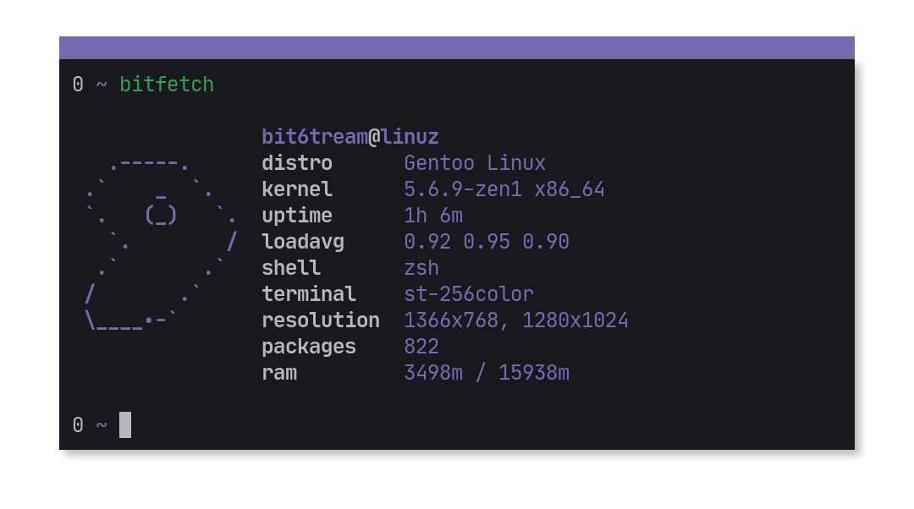

# bitfetch - simple cli system information tool written in C

```shell
    $ make CC=clang bitfetch        # build bitfetch using clang as a C compiler
    $ sudo make install             # install bitfetch to /usr/local/bin (build it before installing)
    $ make bitfetch XINERAMA=NO     # build bitfetch without Xinerama (multimonitor) support
    $ make bitfetch X=NO            # build bitfetch without X support
    $ make bitfetch PKG=NO          # bitfetch won't show number of installed packages
```

```shell
    $ bitfetch -h # view help message
```

# For CRUX, Artix and other distro without /etc/os-release file users

```shell
    # because of youre distro doesn't have /etc/os-release file you need to manually specify youre distro ID
    # artix for Artix linux
    # crux for CRUX linux
    $ make bitfetch ID=crux
    $ make bitfetch ID=artix
    $ make bitfetch ID=asd # if you provide not supported ID bitfetch will be build with generic logo.
```

## Currently supported distros:

+ Arch Linux
+ ArtiX Linux
+ Ataraxia Linux
+ CRUX
+ Debian
+ Elementary OS
+ Fedora Linux
+ Gentoo Linux
+ Kiss Linux
+ Linuxmint
+ Manjaro Linux
+ Opensuse-leap
+ Opensuse-tumbleweed
+ Solus
+ Ubuntu Linux
+ Void Linux

# Dependencies
+ xlib
+ xinerama

## For distros with binary pm you need to install headers ( libx11-dev / libx11-devel  and libxinerama-dev / libxinerama-devel )

# ATTENTION

if you wanna create an issue for me to add your distro support please paste `cat /etc/os-release` output.



# Logo sources:
+ [ufetch](https://gitlab.com/jschx/ufetch)
